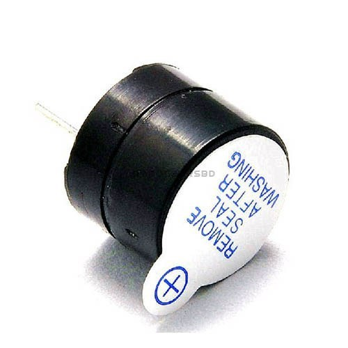

# arduino-EchoRotation-ConUHacks2018
Using the gyroscope sensor data, it modulates the pitch of a tone generator to denote the proper direction.

# Components Used
Arduino 101

Continuous Tone Buzzer

